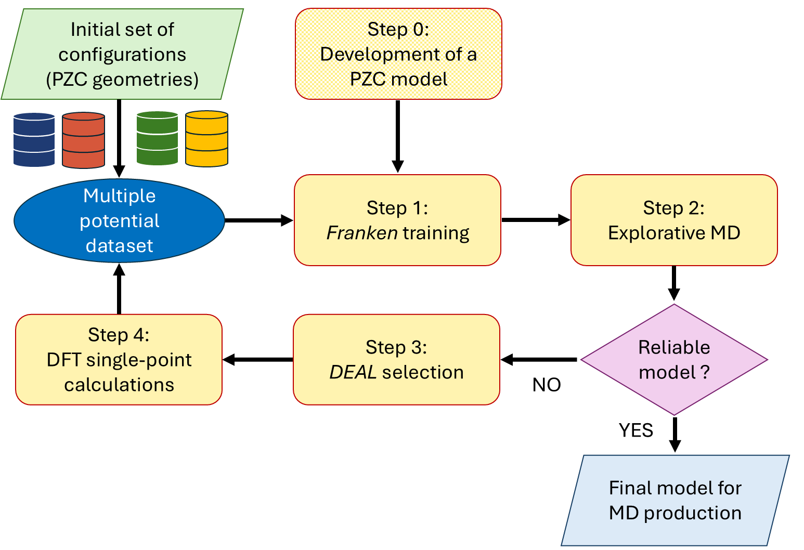

# Workflow to develop ML force-fields for metal/water interface at constant target potentials

The whole workflow is split in four python notebooks, each one associated with a specific step.
The generation of a PZC model is a preliminary step.

Sequence of STEPS:
- STEP 0: Development of a PZC model (alternatively a pre-trained general-purpose model can be employed) => see notebook *Workflow_PZC.ipynb*
- STEP 1: Training via Transfer Learning
- STEP 2: Explorative MD simulation with LAMMPS
- STEP 3: "DEAL" selection of new configurations
- STEP 4: Single-point calculations for the labelling of the configurations at constant potential

Each folder collects the input/output files of a specific step.

  
These steps should be repeated until the generated ML potential is sufficiently reliable, i.e.:
- it allows for stable MD simulations
- it is accurate
- it grants converged physical properties (e.g., solvent density profile) 
