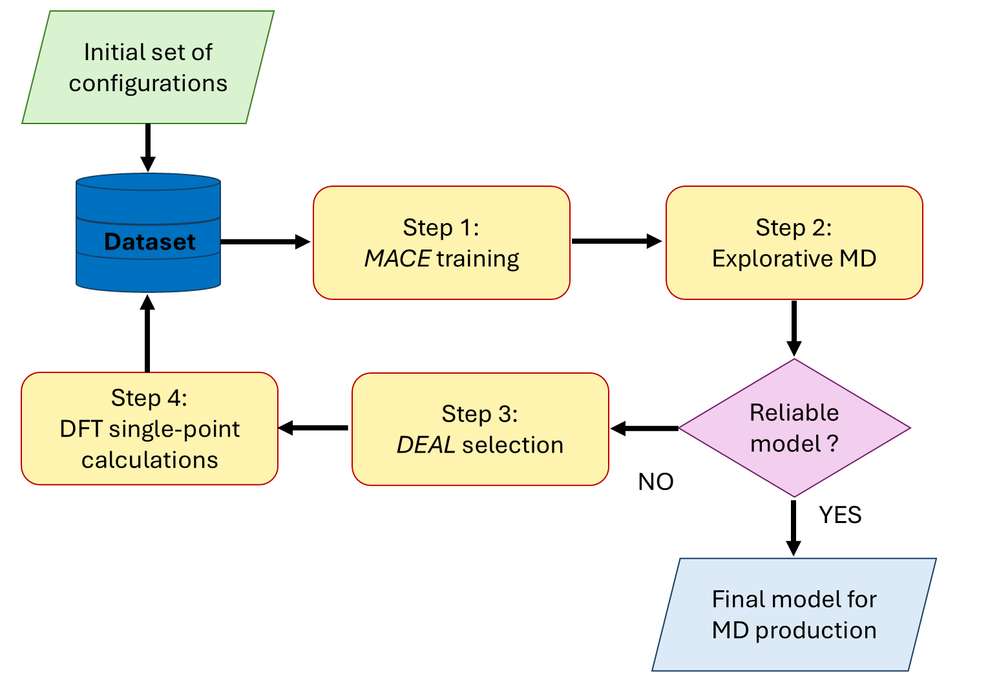

# Workflow to develop an ML force-field for metal/water interface at PZC

*Workflow_PZC.ipynb* describes in detail each step of the workflow:

Sequence of STEPS:
- STEP 1: Training
- STEP 2: Explorative MD simulation with LAMMPS
- STEP 3: "DEAL" selection of new configurations
- STEP 4: DFT-Single-point calculations for the labelling of the configurations

Each folder collects the input/output files of a specific step.

  
These steps should be repeated until the generated ML potential is sufficiently reliable, i.e.:
- it allows for stable MD simulations
- it is accurate
- it grants converged physical properties (e.g., solvent density profile) 
