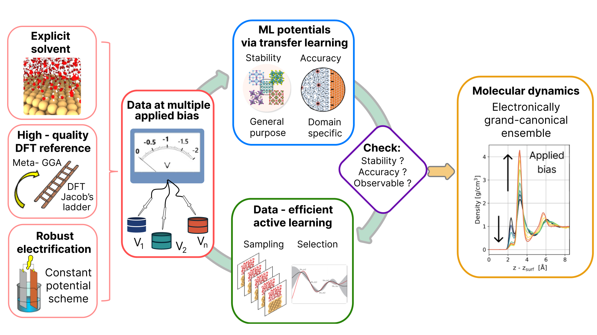

# DoubleReference-MLFF

## Introduction
We present a general workflow that, starting from a high-quality DFT description of the metal/water interface, allows to generate data-efficient Machine Learning (ML) potentials in an electronically grand-canonical ensemble.

The approach relies on three pillars:
  - a high-quality multiple-potential dataset describing the metal/water interface via explicit solvent and in an electronically grand-canonical scheme (see [*Double Reference Method*](https://journals.aps.org/prb/abstract/10.1103/PhysRevB.73.165402))
  - a multiple-potential ML training via [*Franken*](https://www.nature.com/articles/s41524-025-01779-z) transfer learning
  - a "Data Efficient Active Learning" scheme ([*DEAL*](https://www.nature.com/articles/s41524-024-01481-6)) for the sampling and the selection of new configurations.



For detailed information and an example of application to Cu/water interface please check our paper xxxxxxxxxxxxxxx

## Contents
Two workflows to generate ML potentials for metal/water interfaces are reported in this repository:
- workflow for the *potential of zero charge* (PZC) in the "PZC" folder
- workflow for *constant potentials* in the "Constant_potential" folder.

Each workflow is discussed in python notebooks to illustrate each step of the process.

```text
├── PZC                   # Workflow to develop a ML force-field for metal/water interface at PZC 
│   ├── Train
│   ├── MD
│   ├── DEAL
│   └── DFT
├── Constant_potential    # Workflow to develop ML force-fields for metal/water interface at "constant potential" 
│   ├── Train
│   ├── MD
|   ├── DEAL
│   └── DFT
└── workflow_utils        # python modules containing the necessary functions
```

## Requirements
The following software and versions have been used:
- MACE (>=v0.3.13 from [ACEsuit/MACE](https://github.com/ACEsuit/mace) with multi-GPU training support)
- Franken (>=v0.4.0 from [CSML-IIT-UCL/franken](https://github.com/CSML-IIT-UCL/franken/))
- LAMMPS with support of [MACE](https://github.com/ACEsuit/lammps)
- DEAL (from [luigibonati/DEAL/new_DEAL](https://github.com/luigibonati/DEAL/tree/new_deal?tab=readme-ov-file))
- FLARE (v1.3.3-fix from [luigibonati/flare](https://github.com/luigibonati/flare) → modified FLARE version with small fixes)
- a DFT engine (e.g., VASP [package](https://www.vasp.at/))
- DoubleReferenceMethod suite (from [michelegiovannibianchi/FCP-calculator-DoubleReferenceMethod](https://github.com/michelegiovannibianchi/FCP-calculator-DoubleReferenceMethod))

> [!NOTE]  
> The possibility to afford a rigorous "constant potential" approach, like the *Double Reference Method*, is one of the peculiarities of the proposed strategy. However, other "constant potential" schemes can be readily applied to the workflow.

Optional:
- Fessa colormap (from [luigibonati/fessa-color-palette](https://github.com/luigibonati/fessa-color-palette) or from [michelegiovannibianchi/fessa-color-palette](https://github.com/michelegiovannibianchi/fessa-color-palette) for compatibility with Matplotlib>=v3.7.0) 

## Citing
If you find these workflows useful, please cite our work using the following bibtex entry:
xxxxxxxxx
